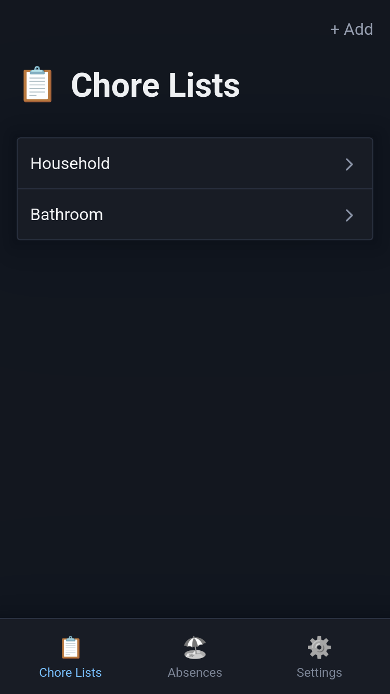
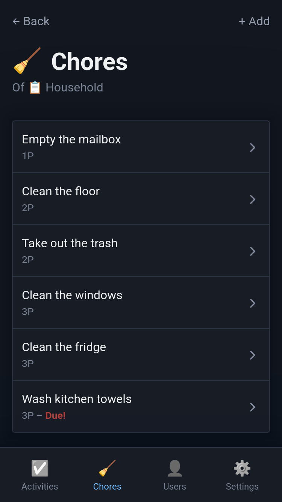
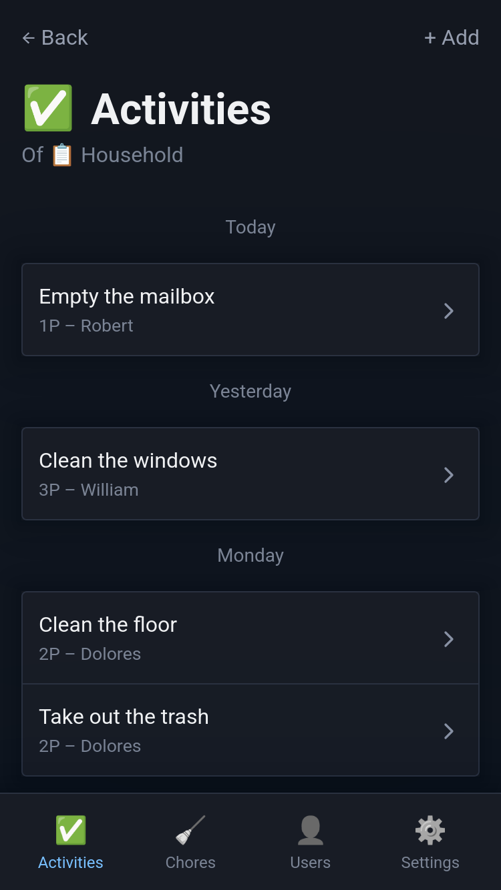
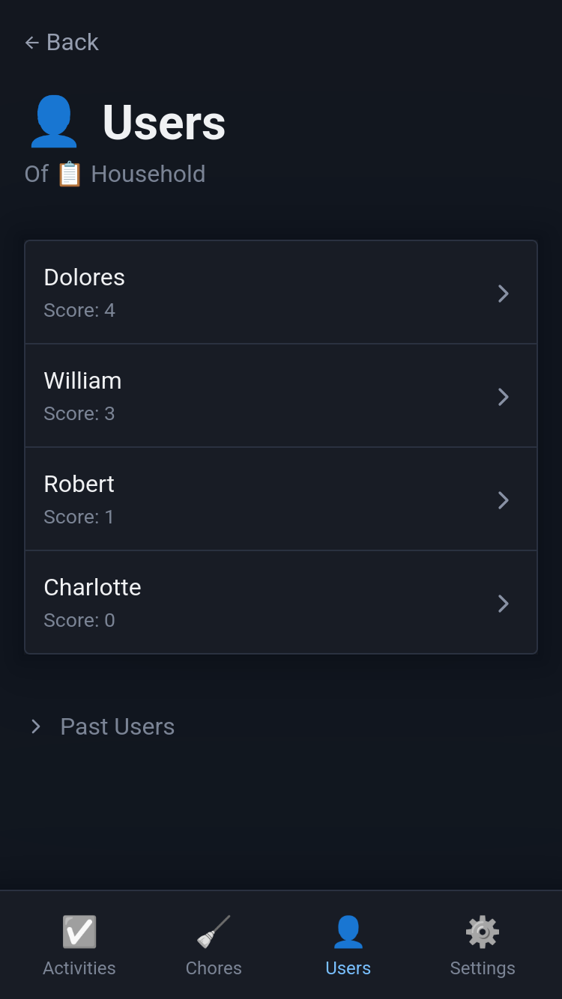

# WG

Track chores of a shared household

## Screenshots

   

[More](./docs/img/screenshots/)

## Setup

### Docker

```bash
docker build -t wg .
docker run -p 80:80 -v "$(pwd)/data:/data" --name wg --rm wg
```

### Docker Compose

```bash
docker compose -f ./docker-compose.prod.yml up
```

### Manual

```bash
cd ./wg-web/
npm install
npm run build:sass
cd ..
cargo run --release
```

## Configuration

The following environment variables can be used for configuration:

| Variable   | Default          |
| ---------- | ---------------- |
| `PORT`     | 80               |
| `DB_FILE`  | ./data/sqlite.db |
| `RUST_LOG` | error            |

### Mails

Either set the environment variable `SMTP_URL` as per [docs](https://docs.rs/lettre/0.11.17/lettre/transport/smtp/struct.SmtpTransport.html#method.from_url). Or set the `SENDMAIL_COMMAND` environment variable to specify a custom sendmail command. If neither are set, the `sendmail` command in your `$PATH` is used.

Then set `MAIL_FROM` and optionally `MAIL_REPLY_TO`.

### Cron Jobs

To periodically send reminders to users with a low score, specify a cron expression in the `LOW_SCORE_REMINDER_CRON` environment variable as per [docs](https://docs.rs/cron/0.15.0/cron/index.html#example).

## FAQ

### How do the points and score work?

Each chore has a certain amount of points - you can define this yourself. Usually more difficult or work-intensive chores have more points. Once you finish a chore you gain that amount of points. There is also a view to see how many points your roommates have in comparison to you. You can configure your chore list to reset the points/score of all users in the following intervals: monthly, quaterly, half-yearly, yearly, never.

### Whats with the name "WG"?

WG is short for "Wohn-gemeinschaft" which is german for "shared apartment".

## License

Copyright (C) Oliver Amann

This project is licensed under the GNU Affero General Public License Version 3 (AGPL-3.0-only). Please see [LICENSE](./LICENSE) for more information.
